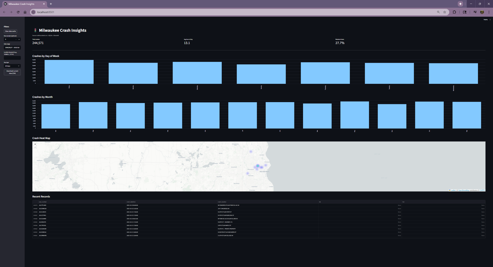

🚦 Milwaukee Crash Insights

An interactive data analytics dashboard that visualizes Milwaukee traffic accidents using Python, SQLite, and Streamlit.
This project demonstrates a complete ETL + visualization pipeline — from raw CSV data to a fully interactive web app with mapping and trend analysis.

🧭 Project Overview

Milwaukee Crash Insights explores patterns in local crash data using:

Real-world open data

Automated data cleaning and transformation

Geocoding for spatial visualization

Interactive dashboards for analysis

This project was built as part of my data engineering / AI developer portfolio to showcase:

End-to-end data pipelines (Extract → Transform → Load)

Database design and caching

Streamlit visualization and UI design

Geospatial data processing and heat mapping

🧱 Tech Stack

Layer	Tool / Library	Purpose
Language	Python 3.11	Core logic
Data Handling	pandas	Cleaning & transformation
Database	SQLite + SQLAlchemy	Lightweight relational storage
Geocoding	OpenStreetMap Nominatim API	Convert addresses → coordinates
Visualization	Streamlit + Folium	Interactive dashboard + heat map
Version Control	Git / GitHub	Project tracking & portfolio

📦 Installation & Setup

1️⃣ Clone the repo
git clone https://github.com/<m6wt>/City-Mobility.git
cd City-Mobility

2️⃣ Create and activate a virtual environment

Windows PowerShell

python -m venv venv
.\venv\Scripts\Activate.ps1

macOS / Linux

python3 -m venv venv
source venv/bin/activate

3️⃣ Install dependencies
pip install -r requirements.txt

(If you don’t have one yet, create it with:)

pip freeze > requirements.txt

🚀 Running the Project
Step 1: Load the data (ETL)
# Create the database and cache (no geocoding calls)
$env:GEOCODE_MODE="cache_only"
python src\load.py

Step 2: Geocode in small batches (optional)

This converts crash locations into lat/lon coordinates for the heat map.

$env:GEOCODE_MODE="limited"
$env:GEOCODE_MAX="100"
python src\load.py

Each run adds more points to geocode_cache — your heat map fills in gradually.

Step 3: Launch the dashboard
streamlit run dashboard\app.py

Then open http://localhost:8501
in your browser.

🗺️ Features

✅ Data Filters

Date range

Location keyword search

Weekday vs weekend toggle

Live CSV export of filtered data

✅ KPIs

Total crash count

Average crash time (hour of day)

% of weekend crashes

✅ Charts

Crashes by day of week

Crashes by month

✅ Heat Map

Visualizes crash density across Milwaukee using Folium

Automatically updates as more locations are geocoded

✅ Caching System

SQLite geocode_cache prevents duplicate geocoding requests

@st.cache_data speeds up dashboard loading

🧠 Skills Demonstrated

Data ingestion and validation

ETL workflow design

Relational database integration (SQLite + SQLAlchemy)

API integration (OpenStreetMap Nominatim)

Streamlit app development and layout design

Geospatial visualization (Folium HeatMap)

Reusable, modular Python code

🔒 Environment Variables

Variable	Description	Example

GEOCODE_MODE	"cache_only" / "limited" / "all"	limited
GEOCODE_MAX	How many new addresses to geocode per run	100
USER_AGENT	Identify yourself to Nominatim	MilwaukeeCrashInsights/1.0

(For permanent setup, create a .env file or export vars in your shell.)

🌟 Future Improvements

Add 3D map with Pydeck

Integrate crash severity or weather data

Enable temporal heat maps (animation over time)

Deploy on Streamlit Cloud or Render

🧑‍💻 Author

Zach Schaub
Data / AI Developer • University of Wisconsin–Milwaukee
https://www.linkedin.com/in/zachariya-schaub/
 • github.com/m6wt

📜 License

MIT License — free for educational and portfolio use.
